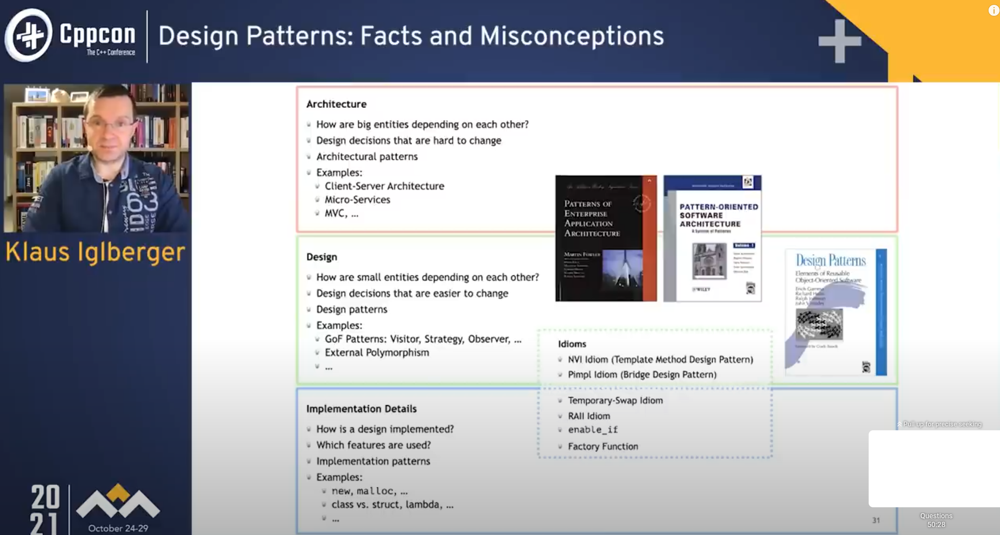

# Design Patterns in C++

This repository contains C++ implementations and notes for a wide variety of software design patterns, including classic patterns from the Gang of Four (GoF), SOLID principles, and advanced C++ idioms.

First, you need to understand what's a design. Klaus Iglberger has a new and and complete angle to look at this.

Guideline
* The purpose of a design pattern is to introduce a fitting abstraction to a well known problem.
* The name of a design pattern conveys the intent of the abstraction.

## Repository Structure

- **Creational Patterns**: Object creation mechanisms, e.g., Builder, Factory, Singleton.
- **Structural Patterns**: Ways to compose objects and classes, e.g., Adapter, Bridge, Composite, Decorator, Facade, Flyweight, Proxy.
- **Behavioral Patterns**: Communication between objects, e.g., Chain of Responsibility, Command, Interpreter, Iterator, Mediator, Memento, Observer, State, Strategy, Template Method, Visitor.
- **SOLID Principles**: Examples and notes on Single Responsibility, Open-Closed, Liskov Substitution, Interface Segregation, and Dependency Inversion principles.
- **CRTP (Curiously Recurring Template Pattern)**: Advanced C++ static polymorphism technique.
- **Miscellaneous**: Other C++ idioms, verbal questions, and system design exercises.

## Notes and References

- `DesignPrinciplesAndPatterns.txt`: Symptoms of rotting design and high-level principles.
- `note.md`: Summaries and categorizations of design patterns.
- Each pattern folder may contain code examples, exercises, and additional notes.

## How to Use

Explore the folders for categorized pattern examples. Many patterns include both code and explanatory notes. Some patterns use modern C++ features and libraries (e.g., Boost).

## AI Assisted Coding Best Practice

- Describe the single, next concrete, incremental change.
- Don’t ask for code, ask for approaches.
- Pick an approach and draft code.
- Review or learn: pull up API docs, ask for explanations, etc.
- Wind back and try a different approach if needed.
- Test your code.
- Commit your changes with Git.
- Ask for suggestions on what could be implemented next.
- Repeat the process.

## Additional Resources

- [Design Pattern.pdf](Design%20Pattern.pdf): Reference material.
- [SOLID/note.md](SOLID/note.md): In-depth notes on SOLID principles.
- [There is No Silver Bullet to Solve All C++ Software Problems](https://www.youtube.com/watch?v=m3UmABVf55g&list=PL5XXu3X6L7jsQpt18_TNitUW5KquxMSan)
- [Design Patterns: Fact and Misconceptions](https://www.youtube.com/watch?v=OvO2NR7pXjg&list=LL)

---

This repository is intended for learning, reference, and interview preparation. Contributions and suggestions are welcome!